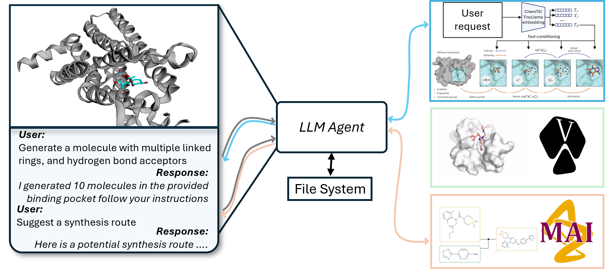
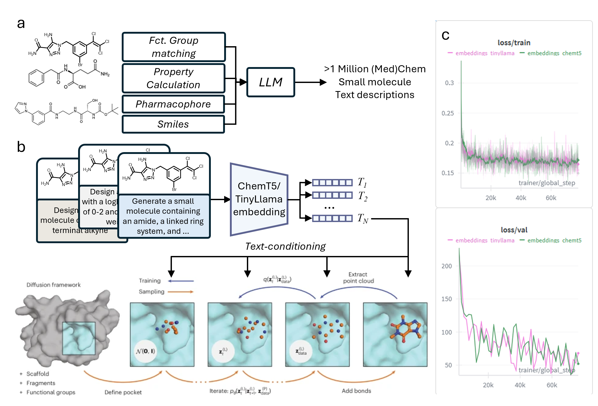

# MIDAS: Language Controlled Molecular Design, and Analysis
<p align="center">
  
</p>

### Give it a try:
|A live demo can be found [here](https://9dfabda19417935be1.gradio.live)

### Conda environment

A conda environment can be created and activated using
```bash
conda env create -f environment.yaml -n midas
conda activate midas
```

### Running the MIDAS Front End

To launch the MIDAS front end from the project root, first export your OpenAI API key:

```bash
export OPENAI_API_KEY=YOUR_OPENAI_API_KEY
```

A required model checkpoint must be downloaded and set before running MIDAS.

You can download the checkpoint and config files from [this Google Drive folder](https://drive.google.com/drive/folders/1KYPGxqjo9HHVani3FrhEmbZvHSaf7dro?usp=sharing).

After downloading, place the checkpoint file and config files in the `./config` directory (or update your configuration to point to its location).

**Example paths:**
```python
CKPT_PATH='./config/chkp_file'
CONFIG_YML='./config/chemt5.yml
```

Then run:

```bash
python frontend/front_end.py
```

- The SMILES string for your target molecule will be entered directly in the frontend user interface.
- Make sure your conda environment is activated and all dependencies are installed before running.

The front end will automatically use the API key from the `OPENAI_API_KEY


## To recreate the dataset generation, and model trainig following these instructions:

<p align="center">
  
</p>

### Pre-trained models
Pre-trained models can be downloaded from [Zenodo](https://zenodo.org/record/8183747).
- [CrossDocked, conditional $`C_\alpha`$ model](https://zenodo.org/record/8183747/files/crossdocked_ca_cond.ckpt?download=1)

```bash
wget -P checkpoints/ https://zenodo.org/record/8183747/files/crossdocked_cond.ckpt
```
It will be stored in the `./checkpoints` folder.

### Instructions for MIDAS

1. Follow instructions to load Crossdocked dataset below

After downloading the dataset run:
```bash
python process_crossdock.py /PATH/TO/CROSSDOCK/  --outdir /PATH/TO/OUTDIR/crossdocked_pocket10_proc_noH_ca_only/ --no_H --ca_only
```

2. Create language description dataset
```bash
python generate_text_descriptions.py PATH/TO/crossdocked_pocket10   --out_csv /PATH/TO/DATAFILE/descriptions.csv   --openai_api_key YOUR_API_KEY   --openai_model gpt-3.5-turbo --num_procs 32
```

3. Combine dataset
```python
import csv
import random
import re


def fix_name(name: str) -> str:
    name = re.sub(r"\#\w+", "", name)
    try:
        second_block = re.search(r"/([^/]+)\.sdf$", name).group(1)
        fixed = re.sub(r"/([^/]+)_pocket", f"/{second_block}_pocket", name, count=1)
    except:
        return name
    return fixed

# Input CSVs
SRC_FILES = [
    "/PATH/TO/DATAFILE/descriptions.csv",
]
DST_CSV = "/PATH/TO/OUTPUT/descriptons_selected.csv"

# Possible source columns for text (extend if more were added)
USE_COLUMNS = ["text_func", "text_llm",...]

rows = []

# Collect rows from all source CSVs
for src in SRC_FILES:
    with open(src) as f_in:
        reader = csv.DictReader(f_in)
        for row in reader:
            # randomly choose one of the available columns
            if row["text_func"] != "No prominent functional groups identified.":
                col = random.choice(USE_COLUMNS)
                rows.append({"name": fix_name(row["name"]), "text": row[col]})
            else:
                rows.append({"name": fix_name(row["name"]), "text": row["text_llm"]})

# Shuffle them
random.shuffle(rows)

# Write to destination
with open(DST_CSV, "w", newline="") as f_out:
    writer = csv.DictWriter(f_out, fieldnames=["name", "text"])
    writer.writeheader()
    writer.writerows(rows)

print(f"Wrote {len(rows)} rows to {DST_CSV}")

```

4. Precompute Embeddings
```bash
python precompute_text_embeddings.py --text_csv /PATH/TO/OUTPUT/descriptons_selected.csv --model_name GT4SD/multitask-text-and-chemistry-t5-base-standard --output /PATH/TO/EMBEDDINGS/text_embeddings.npz --batch_size 32 --device cuda
```

5. Train model (update respective ckpt.yml paths, make suree checkpoints are downlaoded (see below))
```bash
python train.py --config configs/ckpt.yml 
   --resume /PATH/TO/CHECKPOINT/ckpt.ckpt
```

### Structure Based Diffusion Model & Model Code:
The code for training and model architecture was adapted from [DiffSBDD](https://github.com/arneschneuing/DiffSBDD), and extended with a text conditioning module.

### Contributors:
[Sebastian Pagel](https://github.com/pagel-s)
[David Alobo](https://www.linkedin.com/in/david-obeh-alobo-418410a7/)
[Michael Jirasek](https://michaeljirasek.com/)


